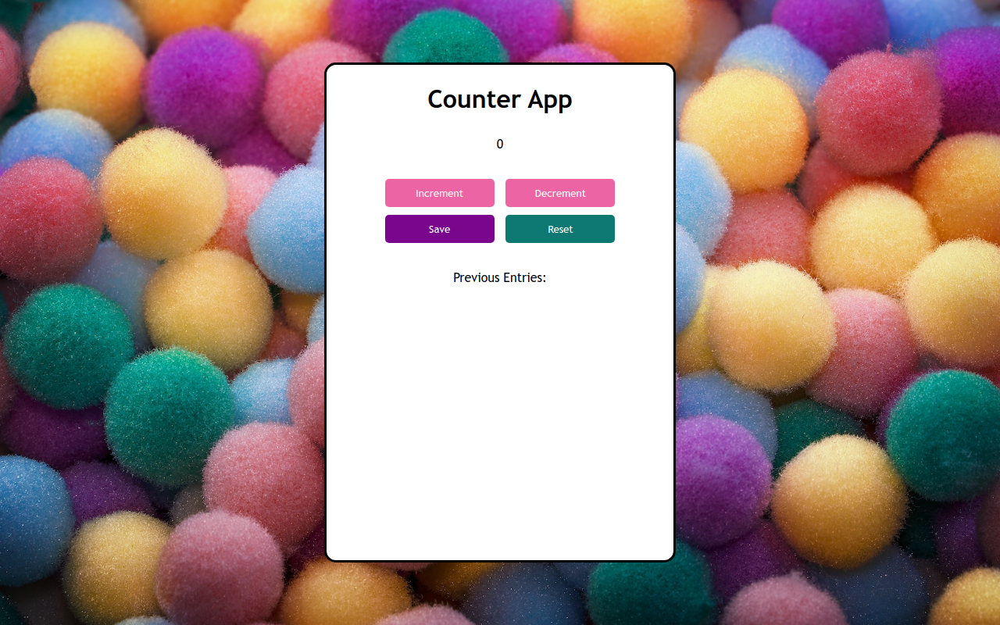

# Passenger Counter Web App

## Overview

Welcome to the Passenger Counter Web App project! This responsive web app is designed for tracking passenger counts and offers simple functionality for incrementing, decrementing, saving, and resetting entries. Built with HTML, CSS, and JavaScript, this project showcases the power of DOM manipulation.


### Table of Contents

- [Installation](#installation)
- [Usage](#usage)
- [Technologies Used](#technologies-used)
- [Features](#features)
- [Project Structure](#project-structure)
- [Credits](#credits)
- [License](#license)



## Installation

To run this project locally, follow these steps:

1. Clone the repository to your local machine.
    ```bash
    git clone https://github.com/m-ramzan786/Counter-App.git
    ```

2. Open the project folder in your code editor.

3. Open the `index.html` file in your web browser.

## Usage

To explore the Passenger Counter Web App:

1. Open the [live demo](https://counter-app-wine-eta.vercel.app/) or run it locally.

2. Use the provided buttons to increment, decrement, save, and reset the passenger count.

## Technologies Used

- HTML
- CSS
- JavaScript (DOM manipulation)

## Features

- **Increment/Decrement:** Increase or decrease the passenger count with dedicated buttons.

- **Save Entries:** Save the current count for reference.

- **Reset Counter:** Set the count back to zero.

## Responsive Design

This web app is designed to be responsive, ensuring a seamless experience across various screen sizes.

## Project Structure

The project is structured for ease of use, with clear buttons and a visual display of the passenger count.

## Credits

- [Muhammad Ramzan](https://github.com/m-ramzan786) - Project Creator

## License

This project is licensed under the [MIT License](LICENSE). Feel free to use and modify the code as per the license terms.

## Badges


## Feedback and Contributions

If you have any feedback or would like to contribute to the project, follow these steps:

1. Fork the project.
2. Create a new branch for your contribution: `git checkout -b feature-name`.
3. Commit your changes: `git commit -m 'Add new feature'`.
4. Push to the branch: `git push origin feature-name`.
5. Open a pull request.

## Contact

If you have any questions, suggestions, or just want to connect, feel free to reach out:

- Email: [mramzanstv@gmail.com](mramzanstv@gmail.com)
- Portfolio: [Muhammad-Ramzan-Portfolio](https://muhammad-ramzan.vercel.app/)
- LinkedIn: [in/m-ramzan786](https://www.linkedin.com/in/m-ramzan786/)

## Tests

The project includes a set of tests to ensure the functionality is working as expected. To run the tests, use the following command:
```bash
npm test
